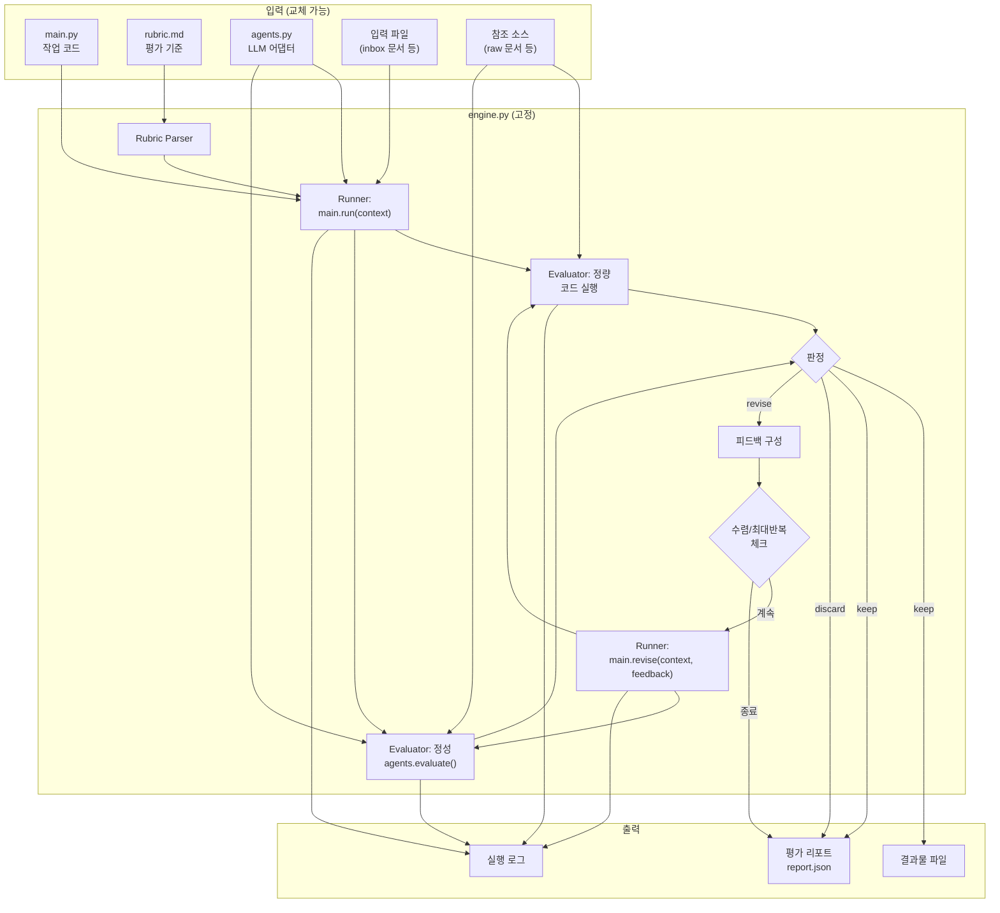

# Quality Loop Engine PRD — 범용 LLM 품질 루프 프레임워크

**문서 버전**: v3.0
**작성일**: 2026-04-06
**상태**: Draft

---

## 1. 개요 및 목표

### 배경

autoresearch 패턴(program.md → train.py → val_bpb → git reset)은 "루프 엔진이 바깥에서 작업 코드를 반복 실행하고, 스칼라 메트릭으로 품질을 판정하며, 실패 시 피드백과 함께 재실행"하는 구조다. 이 패턴을 범용화하여 wiki 생성뿐 아니라 어떤 LLM 작업이든 동일한 루프 엔진 위에서 돌릴 수 있는 프레임워크를 만든다.

핵심 아이디어: **루프 엔진(engine.py)은 고정**, **작업 코드(main.py)와 평가 기준(rubric.md)은 교체 가능**.

### 목표

1. **범용 품질 루프**: 작업 코드와 평가 기준만 교체하면 어떤 LLM 작업에도 적용 가능한 evaluate→revise 루프 엔진을 제공한다.
2. **기계적 검증과 LLM 판단의 명확한 분리**: 정량 항목은 코드로 검증하고, 정성 항목은 LLM이 채점한다. 둘을 혼합하지 않는다.
3. **SDK 무관성**: agents.py 어댑터를 통해 Claude, OpenAI 등 어떤 LLM이든 연결 가능하다.
4. **첫 적용 대상**: 옵시디언 볼트의 wiki 자동화 (inbox → wiki note 생성/업데이트 → 품질 검증 루프).

### autoresearch 대응표

| autoresearch | Quality Loop Engine |
|--------------|-------------------|
| program.md | rubric.md + engine.py 설정 |
| train.py | main.py (작업 코드) |
| val_bpb (단일 스칼라) | rubric 기반 다차원 평가 → 총점 스칼라 |
| git reset (롤백) | 결과물 버저닝 (이전 버전 보존) |
| 고정 루프 스크립트 | engine.py |

---

## 2. 용어 정의

| 용어 | 정의 |
|------|------|
| **engine.py** | 루프 엔진. rubric 파싱 → main.py 실행 → 평가 → 판정 → 재실행을 반복하는 고정 코드 |
| **main.py** | 교체 가능한 작업 코드. 엔진이 호출하는 `run()`과 `revise()` 인터페이스를 구현 |
| **rubric.md** | 교체 가능한 평가 기준 문서. 정해진 마크다운 양식으로 항목명, 타입, 배점, 채점 앵커 등을 정의 |
| **agents.py** | 교체 가능한 LLM SDK 어댑터. `generate()`와 `evaluate()` 인터페이스를 구현 |
| **context** | engine.py가 main.py에 전달하는 실행 컨텍스트. 입력 파일 경로, 참조 소스, agents 인스턴스 포함 |
| **feedback** | revise 판정 시 engine.py가 main.py에 전달하는 구조화된 피드백. 항목별 점수, 근거, 개선 지시 포함 |
| **결과물(output)** | main.py가 생성하는 파일. wiki note, 코드, 문서 등 도메인에 따라 다름 |
| **참조 소스(reference)** | grounding 검증에 사용하는 원본 문서. wiki 도메인에서는 raw 문서 |
| **하드 게이트** | 미달 시 총점과 무관하게 강제 revise하는 필수 조건. 정량 항목에만 적용 |
| **keep/revise/discard** | 루프 판정. keep=완료, revise=피드백 후 재실행, discard=폐기 |
| **iteration** | 루프 1회차. run() 또는 revise() 1회 실행 + 평가 1회를 포함 |

---

## 3. 시스템 아키텍처

### 3.1 컴포넌트 다이어그램

```
┌──────────────────────────────────────────────────────────────┐
│                      engine.py (고정)                         │
│                                                              │
│  ┌─────────┐   ┌───────────┐   ┌──────────┐   ┌──────────┐ │
│  │ Rubric  │   │   Runner  │   │Evaluator │   │  Loop    │ │
│  │ Parser  │   │           │   │          │   │ Control  │ │
│  └────┬────┘   └─────┬─────┘   └────┬─────┘   └────┬─────┘ │
│       │              │              │              │         │
└───────┼──────────────┼──────────────┼──────────────┼─────────┘
        │              │              │              │
   ┌────▼────┐   ┌─────▼─────┐   ┌──▼───┐         │
   │rubric.md│   │ main.py   │   │agents│         │
   │(교체)   │   │ (교체)    │   │.py   │         │
   └─────────┘   └───────────┘   │(교체)│         │
                                  └──────┘         │
                                                    │
                              ┌──────────────────────▼──────┐
                              │  output/  (결과물 + 로그)    │
                              └─────────────────────────────┘
```

### 3.2 컴포넌트 역할

| 컴포넌트 | 고정/교체 | 역할 |
|----------|----------|------|
| **Rubric Parser** | 고정 | rubric.md를 파싱하여 평가 항목 리스트, 하드 게이트, 판정 임계값, 루프 설정을 구조화된 객체로 변환 |
| **Runner** | 고정 | main.py의 `run()` / `revise()`를 호출하고 결과물 파일 경로를 수집 |
| **Evaluator** | 고정 | 결과물을 평가. 정량 항목은 스크립트 실행, 정성 항목은 agents.py.evaluate() 호출 |
| **Loop Control** | 고정 | 판정(keep/revise/discard), 수렴 체크, 최대 반복 체크, 피드백 구성 |
| **rubric.md** | 교체 | 평가 기준 정의 |
| **main.py** | 교체 | 실제 작업 수행 |
| **agents.py** | 교체 | LLM SDK 어댑터 |

---

## 4. 인터페이스 명세

### 4.1 main.py 인터페이스

```python
from dataclasses import dataclass, field
from pathlib import Path
from typing import Protocol

@dataclass
class Context:
    """engine.py가 main.py에 전달하는 실행 컨텍스트"""
    input_files: list[Path]       # 입력 파일 경로 목록 (inbox 문서 등)
    reference_files: list[Path]   # 참조 소스 경로 목록 (grounding 검증용)
    output_dir: Path              # 결과물 저장 디렉토리
    agents: 'AgentsProtocol'      # LLM SDK 어댑터 인스턴스
    config: dict                  # rubric.md에서 파싱한 추가 설정

@dataclass
class Feedback:
    """revise 판정 시 전달되는 피드백"""
    iteration: int                                  # 현재 반복 회차
    total_score: float                              # 총점
    items: list['FeedbackItem']                     # 항목별 피드백
    hard_gate_failures: list['HardGateFailure']     # 하드 게이트 실패 목록
    previous_output_files: list[Path]               # 이전 결과물 경로 (참조용)

@dataclass
class FeedbackItem:
    name: str              # 항목명
    score: float           # 점수
    max_score: float       # 배점
    rationale: str         # 점수 근거
    improvements: list[str]  # 구체적 개선 지시

@dataclass
class HardGateFailure:
    name: str              # 게이트명
    measured: float        # 측정값
    threshold: float       # 기준값
    message: str           # 실패 메시지

@dataclass
class RunResult:
    """main.py가 반환하는 실행 결과"""
    output_files: list[Path]      # 생성/수정된 파일 경로 목록
    metadata: dict = field(default_factory=dict)  # 추가 메타데이터 (선택)

class TaskProtocol(Protocol):
    """main.py가 구현해야 하는 인터페이스"""

    def run(self, context: Context) -> RunResult:
        """최초 실행. context를 받아 결과물을 생성한다."""
        ...

    def revise(self, context: Context, feedback: Feedback) -> RunResult:
        """피드백 기반 재실행. 이전 결과물을 개선한다."""
        ...
```

**구현 규칙**:

- `run()`은 항상 결과물을 `context.output_dir`에 저장해야 한다.
- `revise()`는 `feedback.previous_output_files`를 읽어 이전 결과물을 참조할 수 있다.
- LLM이 필요하면 `context.agents.generate()`를 사용한다. 직접 SDK를 호출하지 않는다.
- 실패 시 예외를 발생시킨다. engine.py가 catch하여 에러 로그에 기록한다.

### 4.2 agents.py 인터페이스

```python
from typing import Protocol

@dataclass
class EvalResult:
    """LLM 평가 결과"""
    scores: dict[str, ItemScore]  # 항목명 → 점수 정보
    raw_response: str             # LLM 원본 응답 (디버깅용)

@dataclass
class ItemScore:
    score: float
    rationale: str
    improvements: list[str]

class AgentsProtocol(Protocol):

    def generate(self, system_prompt: str, user_prompt: str) -> str:
        """LLM에 텍스트 생성을 요청한다.

        main.py가 작업 수행 중 LLM을 호출할 때 사용.
        반환: LLM의 텍스트 응답.
        """
        ...

    def evaluate(
        self,
        system_prompt: str,
        content: str,
        rubric_items: list[dict],
    ) -> EvalResult:
        """LLM에 구조화된 평가를 요청한다.

        engine.py의 Evaluator가 정성 항목 채점 시 사용.
        rubric_items: [{"name": str, "description": str, "max_score": float, "anchors": str}]
        반환: 항목별 점수가 담긴 EvalResult.

        구현 시 LLM 응답을 JSON으로 파싱하여 EvalResult로 변환해야 한다.
        파싱 실패 시 최대 2회 재시도한다.
        """
        ...
```

**구현 예시 (Claude)**:

```python
import anthropic

class ClaudeAgents:
    def __init__(self, model: str = "claude-sonnet-4-20250514"):
        self.client = anthropic.Anthropic()
        self.model = model

    def generate(self, system_prompt: str, user_prompt: str) -> str:
        response = self.client.messages.create(
            model=self.model,
            max_tokens=8192,
            system=system_prompt,
            messages=[{"role": "user", "content": user_prompt}],
        )
        return response.content[0].text

    def evaluate(self, system_prompt: str, content: str, rubric_items: list[dict]) -> EvalResult:
        eval_prompt = f"다음 콘텐츠를 평가하라.\n\n{content}\n\n평가 항목:\n"
        for item in rubric_items:
            eval_prompt += f"- {item['name']} ({item['max_score']}점): {item['description']}\n"
            eval_prompt += f"  채점 앵커:\n{item['anchors']}\n"
        eval_prompt += "\nJSON 형식으로 응답: {\"scores\": {\"항목명\": {\"score\": N, \"rationale\": \"...\", \"improvements\": [\"...\"]}}}"

        for attempt in range(3):
            raw = self.generate(system_prompt, eval_prompt)
            try:
                parsed = json.loads(extract_json(raw))
                return EvalResult(
                    scores={k: ItemScore(**v) for k, v in parsed["scores"].items()},
                    raw_response=raw,
                )
            except (json.JSONDecodeError, KeyError):
                if attempt == 2:
                    raise
```

---

## 5. rubric.md 양식 명세

### 5.1 전체 구조

```markdown
# Rubric: {도메인명}

## 설정
- keep_threshold: 85
- discard_threshold: 70
- max_iterations: 3
- convergence_delta: 3

## 평가 항목

### {항목명}
- **타입**: 정량 | 정성
- **배점**: {N}
- **하드 게이트**: {있음(기준값) | 없음}
- **설명**: {항목이 측정하는 것}

#### 측정 방법 (정량 항목만)
```python
# 이 코드 블록을 engine.py가 추출하여 실행
# 입력: output_files (list[Path]), reference_files (list[Path])
# 반환: {"value": float, "detail": str}
def measure(output_files, reference_files):
    ...
```

#### 채점 앵커 (정성 항목만)
| 점수 구간 | 기준 |
|-----------|------|
| 0–N | ... |
| ... | ... |
```

### 5.2 파싱 규칙

engine.py의 Rubric Parser는 다음 규칙으로 rubric.md를 파싱한다:

1. `## 설정` 섹션에서 key-value 추출 → `RubricConfig` 객체 생성
2. `## 평가 항목` 하위의 각 `### {항목명}` → `RubricItem` 객체 생성
3. 정량 항목의 `#### 측정 방법` 아래 python 코드 블록 → `measure()` 함수로 동적 로드
4. 정성 항목의 `#### 채점 앵커` 아래 테이블 → agents.py.evaluate()에 전달할 앵커 문자열로 추출

```python
@dataclass
class RubricConfig:
    keep_threshold: float       # keep 판정 임계값 (기본 85)
    discard_threshold: float    # discard 판정 임계값 (기본 70)
    max_iterations: int         # 최대 반복 횟수 (기본 3)
    convergence_delta: float    # 수렴 판정 기준 (기본 3)

@dataclass
class RubricItem:
    name: str
    item_type: str              # "quantitative" | "qualitative"
    max_score: float
    description: str
    hard_gate: float | None     # None이면 하드 게이트 없음
    measure_fn: Callable | None # 정량 항목의 측정 함수 (동적 로드)
    anchors: str | None         # 정성 항목의 채점 앵커 텍스트
```

### 5.3 rubric.md 작성 예시 (wiki 도메인)

```markdown
# Rubric: Wiki Automation

## 설정
- keep_threshold: 85
- discard_threshold: 70
- max_iterations: 3
- convergence_delta: 3

## 평가 항목

### Footnote Ratio
- **타입**: 정량
- **배점**: 25
- **하드 게이트**: 0.8
- **설명**: wiki note 본문의 서술 문장 중 raw 출처 각주([^...])가 달린 비율

#### 측정 방법
```python
import re
def measure(output_files, reference_files):
    for f in output_files:
        text = f.read_text()
        sentences = [s.strip() for s in re.split(r'[.?!]\s', text) if s.strip()]
        # 헤딩, 빈줄, YAML frontmatter 제외
        sentences = [s for s in sentences if not s.startswith('#') and not s.startswith('---')]
        if not sentences:
            return {"value": 0.0, "detail": "서술 문장 없음"}
        cited = sum(1 for s in sentences if re.search(r'\[\^[^\]]+\]', s))
        ratio = cited / len(sentences)
        return {"value": round(ratio, 3), "detail": f"{cited}/{len(sentences)} 문장에 각주"}
```

### Country Sections
- **타입**: 정량
- **배점**: 0
- **하드 게이트**: 3
- **설명**: wiki note의 마크다운 헤딩 중 국가명을 포함하는 섹션 수

#### 측정 방법
```python
import re
COUNTRIES = ["한국", "미국", "일본", "중국", "EU", "영국", "독일", "프랑스", "캐나다", "호주"]
def measure(output_files, reference_files):
    for f in output_files:
        text = f.read_text()
        headings = re.findall(r'^#{1,3}\s+(.+)$', text, re.MULTILINE)
        count = sum(1 for h in headings if any(c in h for c in COUNTRIES))
        return {"value": count, "detail": f"국가 섹션 {count}개"}
```

### Example Count
- **타입**: 정량
- **배점**: 0
- **하드 게이트**: 3
- **설명**: wiki note 내 대표 사례/예시 블록 수

#### 측정 방법
```python
import re
def measure(output_files, reference_files):
    for f in output_files:
        text = f.read_text()
        keywords = ["사례", "case", "예시", "example", "예:"]
        count = sum(len(re.findall(rf'(?i)\b{kw}\b', text)) for kw in keywords)
        return {"value": count, "detail": f"사례 키워드 {count}건"}
```

### Coverage
- **타입**: 정성
- **배점**: 25
- **하드 게이트**: 없음
- **설명**: wiki note가 해당 주제의 핵심 측면을 얼마나 포괄하는지

#### 채점 앵커
| 점수 구간 | 기준 | 판정 예시 |
|-----------|------|----------|
| 0–5 | 주제의 한 측면만 언급. 핵심 개념 대부분 누락 | raw에서 토픽 10개 추출 가능한데 1~2개만 다룸 |
| 6–10 | 2~3개 측면을 다루나 주요 하위 주제 누락 | 커버 비율 20~40% |
| 11–15 | 핵심 하위 주제 대부분 존재, 깊이 불균일 | 커버 비율 40~60%. 일부 섹션이 1줄짜리 |
| 16–20 | 모든 핵심 하위 주제, 깊이 균일 | 커버 비율 60~80%. 각 섹션 2문단+ |
| 21–25 | 핵심 + 엣지 케이스까지 포괄 | 커버 비율 80%+. family note 간 중복 없이 보완적 |

### Grounding Accuracy
- **타입**: 정성
- **배점**: 25
- **하드 게이트**: 없음
- **설명**: 각주가 가리키는 raw 문서와 wiki note의 주장이 실제로 일치하는지

#### 채점 앵커
| 점수 구간 | 기준 | 판정 예시 |
|-----------|------|----------|
| 0–5 | 각주가 있으나 내용 불일치 다수 | 인용한 raw와 wiki 주장이 다른 경우 3건+ |
| 6–10 | 주요 주장은 일치하나 세부 수치/날짜 불일치 | 날짜나 금액이 다른 경우 존재 |
| 11–15 | 대부분 일치하나 1~2건 미묘한 차이 | 맥락 미세 왜곡 |
| 16–20 | 모든 핵심 주장이 raw와 정확히 일치 | 불일치 없음 |
| 21–25 | 정확한 일치 + raw의 뉘앙스까지 보존 | 조건부 진술의 조건까지 충실히 반영 |

### Discrimination
- **타입**: 정성
- **배점**: 10
- **하드 게이트**: 없음
- **설명**: 동일 family 내 다른 wiki note와의 의미적 중복이 없는지

#### 채점 앵커
| 점수 구간 | 기준 | 판정 예시 |
|-----------|------|----------|
| 0–2 | 내용 50%+ 중복 | family note와 핵심 섹션이 거의 동일 |
| 3–4 | 중복 20~50% | 도입부와 일부 절차가 겹침 |
| 5–6 | 중복 10~20% | 배경 설명만 겹침 |
| 7–8 | 중복 < 10% | 각 note 고유 영역 명확 |
| 9–10 | 중복 없음 | 상호 참조 적절, 독립적 완결 |

### Actionability
- **타입**: 정성
- **배점**: 10
- **하드 게이트**: 없음
- **설명**: 신규 담당자가 wiki note만으로 업무를 수행할 수 있는지

#### 채점 앵커
| 점수 구간 | 기준 | 판정 예시 |
|-----------|------|----------|
| 0–2 | 추상적 설명만, 절차 없음 | "서류를 준비한다" — 목록/양식/기한 없음 |
| 3–4 | 일부 절차 있으나 실행 불가 | 서류 목록은 있으나 작성법 누락 |
| 5–6 | 주요 절차 있으나 예외 미흡 | 정상 케이스만, 반려 시 대응 없음 |
| 7–8 | 절차·기준·분기 대부분 갖춤 | 정상+예외, 기한, 담당 부서 명시 |
| 9–10 | 완전한 가이드 | 신규 담당자 즉시 수행 가능, FAQ 포함 |

### Restraint
- **타입**: 정성
- **배점**: 5
- **하드 게이트**: 없음
- **설명**: raw에 없는 내용(hallucination, 과도한 추론)이 억제되었는지

#### 채점 앵커
| 점수 구간 | 기준 | 판정 예시 |
|-----------|------|----------|
| 0–1 | raw에 없는 주장 3건+ | 근거 없는 일반화 다수 |
| 2 | raw에 없는 주장 1~2건 | 과도한 일반화 1건 |
| 3 | 범위 약간 넘는 추론이 있으나 명시됨 | "~로 추정된다" 표현 사용 |
| 4 | raw 기반만 존재 | 추론 시 명시적 구분 |
| 5 | 엄격하게 raw 내용만 | 불확실한 내용 없음 |
```

---

## 6. engine.py 루프 상세 플로우

### 6.1 의사코드

```python
def run_loop(
    main: TaskProtocol,
    rubric_path: Path,
    input_files: list[Path],
    reference_files: list[Path],
    agents: AgentsProtocol,
    output_dir: Path,
) -> LoopReport:
    # ── 초기화 ──
    rubric = RubricParser.parse(rubric_path)
    config = rubric.config  # keep_threshold, discard_threshold, max_iterations, convergence_delta
    context = Context(
        input_files=input_files,
        reference_files=reference_files,
        output_dir=output_dir,
        agents=agents,
        config=rubric.extra_config,
    )
    history: list[IterationRecord] = []
    prev_score = 0.0

    # ── 최초 실행 ──
    try:
        result = main.run(context)
    except Exception as e:
        return LoopReport(status="error", error=str(e), history=[])

    # ── 루프 ──
    for iteration in range(1, config.max_iterations + 1):
        # 1. 평가
        eval_result = evaluate(result.output_files, reference_files, rubric, agents)

        # 2. 히스토리 기록
        record = IterationRecord(
            iteration=iteration,
            scores=eval_result.scores,
            total=eval_result.total,
            hard_gate_results=eval_result.hard_gates,
            verdict=None,  # 아래에서 결정
        )

        # 3. 하드 게이트 체크
        gate_failures = [g for g in eval_result.hard_gates if not g.passed]

        # 4. 판정
        if not gate_failures and eval_result.total >= config.keep_threshold:
            record.verdict = "keep"
            history.append(record)
            break

        if eval_result.total < config.discard_threshold and iteration > 1:
            record.verdict = "discard"
            history.append(record)
            break

        # 5. 수렴 체크 (2회차부터)
        if iteration > 1:
            delta = eval_result.total - prev_score
            if delta < config.convergence_delta:
                record.verdict = "converged"
                history.append(record)
                break

        # 6. 최대 반복 체크
        if iteration == config.max_iterations:
            record.verdict = "max_iterations"
            history.append(record)
            break

        # 7. revise 결정
        record.verdict = "revise"
        history.append(record)
        prev_score = eval_result.total

        # 8. 피드백 구성
        feedback = build_feedback(
            iteration=iteration,
            eval_result=eval_result,
            gate_failures=gate_failures,
            previous_output_files=result.output_files,
        )

        # 9. revise 실행
        try:
            result = main.revise(context, feedback)
        except Exception as e:
            history.append(IterationRecord(
                iteration=iteration + 1,
                verdict="error",
                error=str(e),
            ))
            break

    # ── 결과 구성 ──
    final = history[-1]
    return LoopReport(
        status=final.verdict,
        final_score=final.total if hasattr(final, 'total') else None,
        output_files=result.output_files if final.verdict == "keep" else [],
        history=history,
    )
```

### 6.2 evaluate() 함수 상세

```python
def evaluate(
    output_files: list[Path],
    reference_files: list[Path],
    rubric: Rubric,
    agents: AgentsProtocol,
) -> EvalOutput:
    scores = {}
    hard_gates = []

    # ── 정량 항목: 코드 실행 ──
    for item in rubric.quantitative_items:
        measurement = item.measure_fn(output_files, reference_files)
        value = measurement["value"]

        # 하드 게이트 판정
        if item.hard_gate is not None:
            passed = value >= item.hard_gate
            hard_gates.append(HardGateResult(
                name=item.name,
                threshold=item.hard_gate,
                measured=value,
                passed=passed,
            ))

        # 점수 변환 (배점 > 0인 경우만)
        if item.max_score > 0:
            # 선형 매핑: 0~하드게이트 → 0~max_score (하드게이트 없으면 0~1 → 0~max_score)
            ceiling = item.hard_gate if item.hard_gate else 1.0
            score = min(item.max_score, (value / ceiling) * item.max_score)
            scores[item.name] = ItemScore(
                score=round(score, 1),
                rationale=measurement["detail"],
                improvements=[],
            )

    # ── 정성 항목: LLM 평가 ──
    qualitative_items = [
        {
            "name": item.name,
            "description": item.description,
            "max_score": item.max_score,
            "anchors": item.anchors,
        }
        for item in rubric.qualitative_items
    ]

    if qualitative_items:
        # 평가 대상 콘텐츠 구성
        content = ""
        for f in output_files:
            content += f"## {f.name}\n{f.read_text()}\n\n"

        # 참조 소스 포함 (grounding 평가용)
        ref_content = ""
        for f in reference_files:
            ref_content += f"## [REF] {f.name}\n{f.read_text()}\n\n"

        system_prompt = (
            "당신은 문서 품질 평가 전문가입니다. "
            "아래 채점 앵커를 엄격하게 적용하여 채점하세요. "
            "경계 점수에서는 낮은 쪽으로 보수적으로 채점하세요. "
            "각 항목에 대해 score, rationale, improvements를 반드시 제공하세요."
        )

        eval_content = f"{content}\n---\n참조 소스:\n{ref_content}"
        llm_result = agents.evaluate(system_prompt, eval_content, qualitative_items)
        scores.update(llm_result.scores)

    # ── 총점 ──
    total = sum(s.score for s in scores.values())

    return EvalOutput(scores=scores, hard_gates=hard_gates, total=round(total, 1))
```

### 6.3 build_feedback() 함수 상세

```python
def build_feedback(
    iteration: int,
    eval_result: EvalOutput,
    gate_failures: list[HardGateResult],
    previous_output_files: list[Path],
) -> Feedback:
    items = []
    for name, score_info in eval_result.scores.items():
        item = rubric.get_item(name)
        items.append(FeedbackItem(
            name=name,
            score=score_info.score,
            max_score=item.max_score,
            rationale=score_info.rationale,
            improvements=score_info.improvements,
        ))

    # 점수 낮은 순으로 정렬 (개선 우선순위)
    items.sort(key=lambda x: x.score / x.max_score if x.max_score > 0 else 0)

    hard_gate_failures = [
        HardGateFailure(
            name=g.name,
            measured=g.measured,
            threshold=g.threshold,
            message=f"{g.name}: {g.measured} < {g.threshold}",
        )
        for g in gate_failures
    ]

    return Feedback(
        iteration=iteration,
        total_score=eval_result.total,
        items=items,
        hard_gate_failures=hard_gate_failures,
        previous_output_files=previous_output_files,
    )
```

---

## 7. 평가 파이프라인 상세

### 7.1 기계적 검증 (정량 항목)

정량 항목은 rubric.md의 `측정 방법` 코드 블록을 engine.py가 동적으로 실행한다.

**실행 환경**:

- rubric.md의 python 코드 블록을 `exec()`으로 로드하여 `measure()` 함수를 추출
- `measure(output_files, reference_files)` 시그니처를 강제
- 반환값은 반드시 `{"value": float, "detail": str}` 형태
- 실행 시간 제한: 10초 (타임아웃 시 에러 처리)
- 표준 라이브러리 + `re`, `pathlib`, `json`만 사용 가능 (보안)

**하드 게이트 판정**:

```
if item.hard_gate is not None and measured_value < item.hard_gate:
    → 해당 게이트 실패. 총점과 무관하게 revise 강제.
    → feedback에 하드 게이트 실패 사유 포함.
```

**배점이 0인 정량 항목**: 하드 게이트 검증만 수행하고 총점에는 기여하지 않는다. (예: Country Sections, Example Count)

### 7.2 LLM 판단 (정성 항목)

정성 항목은 agents.py.evaluate()를 통해 LLM이 채점한다.

**LLM에 전달되는 정보**:

1. 시스템 프롬프트: 평가 전문가 역할 + 채점 원칙 (보수적 채점, 경계 시 낮은 쪽)
2. 평가 대상 콘텐츠: 결과물 파일 전문
3. 참조 소스: reference 파일 전문 (Grounding Accuracy 평가에 필수)
4. 루브릭 항목: 항목명, 설명, 배점, 채점 앵커 테이블

**응답 형식 (JSON 강제)**:

```json
{
  "scores": {
    "Coverage": {
      "score": 18,
      "rationale": "raw에서 토픽 8개 식별. wiki가 6개 다룸 (75%). 관세 절차 섹션 깊이 부족.",
      "improvements": ["관세 절차 섹션을 2문단 이상으로 확장", "통관 예외 케이스 추가"]
    }
  }
}
```

**재시도 정책**: JSON 파싱 실패 시 최대 2회 재시도. 3회 연속 실패 시 해당 항목을 0점 처리하고 에러 로그 기록.

### 7.3 정량/정성 분리 원칙

| 구분 | 정량 | 정성 |
|------|------|------|
| **실행 주체** | engine.py (코드) | agents.py (LLM) |
| **결정론적** | 예 (동일 입력 → 동일 결과) | 아니오 |
| **속도** | 밀리초 단위 | 초~분 단위 |
| **용도** | 구조적 요건 (비율, 개수, 형식) | 의미적 품질 (정확성, 완결성, 유용성) |
| **하드 게이트 적용** | 가능 | 불가 (LLM 판단의 변동성 때문) |
| **rubric 작성** | python `measure()` 함수 | 채점 앵커 테이블 |

---

## 8. 안전장치

### 8.1 최대 반복 횟수

- rubric.md의 `max_iterations` 값 (기본 3, 범위 1–10)
- 초과 시: 마지막 결과물을 보존하고 `max_iterations` verdict로 종료

### 8.2 수렴 판정

- 2회차부터 적용: `현재 총점 - 이전 총점 < convergence_delta`이면 수렴으로 판정
- 수렴 시: 현재 결과물을 최종본으로 확정. 최종 점수가 keep_threshold 미만이면 리포트에 "수동 검토 권고" 포함

### 8.3 discard 판정

- `총점 < discard_threshold`이고 `iteration > 1` (최초 실행은 discard하지 않음, 최소 1회 revise 기회 부여)
- discard 시: 결과물 파일은 `output_dir/.discarded/`로 이동. 리포트에 사유 포함.

### 8.4 에러 처리

| 에러 | 발생 지점 | 처리 |
|------|----------|------|
| main.py.run() 예외 | 최초 실행 | 루프 즉시 종료, error verdict |
| main.py.revise() 예외 | revise 실행 | 루프 즉시 종료, 마지막 성공 결과물 보존 |
| measure() 타임아웃 | 정량 평가 | 해당 항목 0점, 에러 로그 |
| measure() 예외 | 정량 평가 | 해당 항목 0점, 에러 로그 |
| agents.evaluate() 파싱 실패 (3회) | 정성 평가 | 해당 항목 0점, 에러 로그 |
| LLM API 장애 | agents.py | 3회 재시도 → 실패 시 루프 중단 |

### 8.5 결과물 버저닝

각 iteration의 결과물을 보존하여 롤백 가능하게 한다.

```
output_dir/
├── iter_1/          # run() 결과물
│   └── wiki_note.md
├── iter_2/          # revise() 1회차 결과물
│   └── wiki_note.md
├── iter_3/          # revise() 2회차 결과물
│   └── wiki_note.md
├── final/           # 최종 결과물 (keep된 iteration의 복사)
│   └── wiki_note.md
├── .discarded/      # discard된 결과물
└── report.json      # 평가 리포트
```

---

## 9. 데이터 플로우 다이어그램



---

## 10. 적용 사례: Wiki 자동화

이 프레임워크로 옵시디언 볼트의 wiki ingest + review를 구현하는 구체적 예시.

### 10.1 파일 구성

```
wiki_automation/
├── engine.py          # 범용 루프 엔진 (프레임워크 제공)
├── main.py            # wiki 도메인 작업 코드
├── rubric.md          # wiki 도메인 평가 기준 (섹션 5.3 참조)
├── agents.py          # Claude SDK 어댑터
└── config.yaml        # 볼트 경로 등 환경 설정
```

### 10.2 main.py 구현 개요

```python
class WikiTask:
    """wiki ingest + 생성/업데이트 작업"""

    def run(self, context: Context) -> RunResult:
        agents = context.agents
        output_files = []

        for doc_path in context.input_files:
            doc_text = doc_path.read_text()

            # 1. 기존 wiki 매칭
            wiki_index = self._build_wiki_index(context.reference_files)
            match_result = agents.generate(
                system_prompt=MATCH_SYSTEM_PROMPT,
                user_prompt=f"문서:\n{doc_text}\n\nwiki 목록:\n{wiki_index}",
            )
            match = json.loads(match_result)

            # 2. wiki note 생성 또는 업데이트
            if match["action"] == "create":
                wiki_content = agents.generate(
                    system_prompt=CREATE_SYSTEM_PROMPT,  # AGENTS.md 규칙 포함
                    user_prompt=f"raw 문서:\n{doc_text}",
                )
            else:
                existing = Path(match["target_wiki"]).read_text()
                wiki_content = agents.generate(
                    system_prompt=UPDATE_SYSTEM_PROMPT,  # AGENTS.md 규칙 포함
                    user_prompt=f"기존 wiki:\n{existing}\n\n새 raw:\n{doc_text}",
                )

            # 3. 저장
            out_path = context.output_dir / f"{match.get('title', doc_path.stem)}.md"
            out_path.write_text(wiki_content)
            output_files.append(out_path)

        return RunResult(output_files=output_files)

    def revise(self, context: Context, feedback: Feedback) -> RunResult:
        agents = context.agents
        output_files = []

        for prev_file in feedback.previous_output_files:
            prev_content = prev_file.read_text()

            # 피드백을 구조화된 지시로 변환
            revision_prompt = self._build_revision_prompt(prev_content, feedback)

            revised = agents.generate(
                system_prompt=REVISE_SYSTEM_PROMPT,  # AGENTS.md 규칙 + "raw만 참조" 지시
                user_prompt=revision_prompt,
            )

            out_path = context.output_dir / prev_file.name
            out_path.write_text(revised)
            output_files.append(out_path)

        return RunResult(output_files=output_files)

    def _build_revision_prompt(self, content: str, feedback: Feedback) -> str:
        lines = [f"현재 wiki note:\n{content}\n"]
        lines.append(f"총점: {feedback.total_score}\n")

        if feedback.hard_gate_failures:
            lines.append("## 하드 게이트 실패 (최우선 수정)")
            for g in feedback.hard_gate_failures:
                lines.append(f"- {g.message}")

        lines.append("\n## 항목별 피드백 (점수 낮은 순)")
        for item in feedback.items:
            lines.append(f"### {item.name} ({item.score}/{item.max_score})")
            lines.append(f"근거: {item.rationale}")
            for imp in item.improvements:
                lines.append(f"- 개선: {imp}")

        # 참조 소스 첨부
        lines.append("\n## 참조 소스 (raw 문서)")
        for ref in feedback.previous_output_files:  # context.reference_files 사용
            pass  # 실제 구현에서는 reference_files를 첨부

        return "\n".join(lines)
```

### 10.3 실행

```python
from engine import run_loop
from main import WikiTask
from agents import ClaudeAgents
from pathlib import Path

report = run_loop(
    main=WikiTask(),
    rubric_path=Path("rubric.md"),
    input_files=list(Path("4. Archive/inbox/").glob("*.md")),
    reference_files=list(Path("3. Resource/LLM Knowledge Base/wiki/").glob("*.md")),
    agents=ClaudeAgents(),
    output_dir=Path("output/wiki_run_001/"),
)

print(f"Status: {report.status}")
print(f"Final score: {report.final_score}")
print(f"Iterations: {len(report.history)}")
```

### 10.4 출력 예시 (report.json)

```json
{
  "status": "keep",
  "final_score": 87.0,
  "output_files": ["output/wiki_run_001/final/변경제출.md"],
  "history": [
    {
      "iteration": 1,
      "scores": {
        "Footnote Ratio": {"score": 18.0, "rationale": "29/38 문장에 각주 (0.763)"},
        "Coverage": {"score": 16, "rationale": "토픽 8개 중 5개 커버"},
        "Grounding Accuracy": {"score": 20, "rationale": "핵심 주장 일치, 1건 미묘한 차이"},
        "Discrimination": {"score": 8, "rationale": "신규제출.md와 도입부 겹침"},
        "Actionability": {"score": 6, "rationale": "반려 시 대응 절차 없음"},
        "Restraint": {"score": 4, "rationale": "raw 기반 내용만 존재"}
      },
      "total": 72.0,
      "hard_gate_results": [
        {"name": "Footnote Ratio", "threshold": 0.8, "measured": 0.763, "passed": false},
        {"name": "Country Sections", "threshold": 3, "measured": 4, "passed": true},
        {"name": "Example Count", "threshold": 3, "measured": 5, "passed": true}
      ],
      "verdict": "revise"
    },
    {
      "iteration": 2,
      "scores": {
        "Footnote Ratio": {"score": 22.5, "rationale": "34/38 문장에 각주 (0.895)"},
        "Coverage": {"score": 21, "rationale": "토픽 8개 중 7개 커버, 관세 절차 확장됨"},
        "Grounding Accuracy": {"score": 22, "rationale": "모든 핵심 주장 일치"},
        "Discrimination": {"score": 8, "rationale": "도입부 중복 해소"},
        "Actionability": {"score": 8, "rationale": "반려 절차 추가됨, FAQ 미흡"},
        "Restraint": {"score": 5, "rationale": "엄격하게 raw 내용만"}
      },
      "total": 86.5,
      "hard_gate_results": [
        {"name": "Footnote Ratio", "threshold": 0.8, "measured": 0.895, "passed": true},
        {"name": "Country Sections", "threshold": 3, "measured": 4, "passed": true},
        {"name": "Example Count", "threshold": 3, "measured": 5, "passed": true}
      ],
      "verdict": "keep"
    }
  ]
}
```

---

## 11. 미결 사항 / 열린 질문

| # | 항목 | 상세 | 우선순위 |
|---|------|------|----------|
| 1 | measure() 보안 | rubric.md의 python 코드 블록을 `exec()`로 실행하는 것의 보안 위험. sandboxing 또는 허용 모듈 화이트리스트 범위 확정 필요 | 높음 |
| 2 | 정량 항목 점수 변환 | 현재 선형 매핑(value/ceiling × max_score)을 사용하나, 항목별로 커스텀 매핑이 필요할 수 있음. rubric.md에 매핑 함수를 포함시킬지? | 높음 |
| 3 | 대용량 참조 소스 | reference 파일이 많으면 LLM 컨텍스트 윈도우 초과. 요약/청킹 전략 필요 | 중간 |
| 4 | main.py의 run()과 revise() 경계 | revise()가 이전 결과물을 0부터 재생성하는가, 증분 수정하는가? 구현자에게 맡기되 가이드라인 필요 | 중간 |
| 5 | inbox → Archive 이동 | wiki 도메인에서 처리 완료 문서의 Archive 배치 기준 미정. main.py의 책임인가, engine.py 외부 후처리인가? | 중간 |
| 6 | 동시 실행 | 같은 rubric으로 여러 main.py 인스턴스를 병렬 실행할 때 output_dir 충돌 방지 | 낮음 |
| 7 | 평가 항목 간 의존성 | Coverage가 낮으면 Actionability도 낮아지는 등 항목 간 상관관계. 가중 피드백이 필요한가? | 낮음 |
